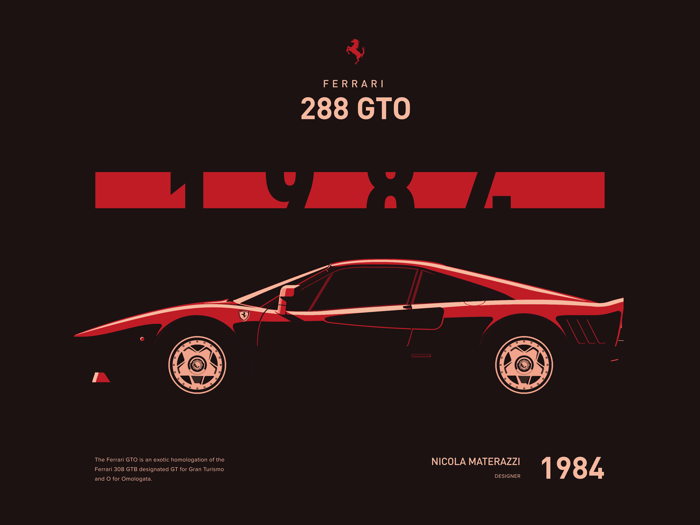

# Mr Sam Law - Full Stack Developer Updated Porfolio

## Deployment
The portfolio has been deployed at:
[https://mrsamlaw.github.io/08-ProfessionalMaterials/](https://mrsamlaw.github.io/08-ProfessionalMaterials/)

## Technologies
- HTML
- CSS
- Bootstrap
- JavaScript

## Description
An update of my portfolio showcasing development work, with scope for more work to be added in.

## What We Did
Some backend upgrades, using objects for Portfolio items, and styling most of the page utilising Bootstrap

## Screenshot

## Inspiration
The color styling was inspired by this image: Ferrari 288 GTO by artist Michał Zagórski (https://dribbble.com/mvcnphorm).

